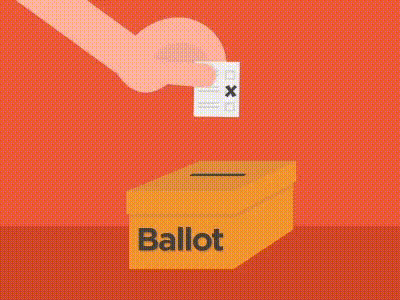

# Election_Analysis
Python election analysis

## Project Overview

A Colorado Board of Elections employee requested has given you the following tasks to complete an election audit of a recent local congressional election. 

 1. Calculate the total number of votes cast. 
 2. Get a complete list of candidates who received votes. 
 3. Calculate the total number of votes each candidate received. 
 4. Calculate the percentage of votes each candidate won. 
 5. Determine the winner of the election based on popular vote.
    
    

Source: https://gfycat.com/grouchypoorbullfrog-election-day-vote
    
## Resources

**Data Source:**

-election_results.csv

**Software:** 

-Python 3.8.3, Visual Studio Code 1.46.0

## Summary

#### Election Results
-------------------------
#### Total Votes: 369,711
-------------------------
* The candidates were:
	- Charles Casper Stockham
	- Diana DeGette
	- Raymon Anthony Doane
	
Charles Casper Stockham: 23.0% (85,213)

Diana DeGette: 73.8% (272,892)

Raymon Anthony Doane: 3.1% (11,606)

-------------------------
##### Winner: Diana DeGette
##### Winning Vote Count: 272,892
##### Winning Percentage: 73.8%

## Challenge Overview

1. Calculate the total number of votes cast. 
2. Get a complete list of candidates who received votes. 
3. Calculate the total number of votes each candidate received. 
4. Calculate the percentage of votes each candidate won. 
5. Determine the winner of the election based on popular vote.
6. Calculate the voter turnout for each county.
7. Calculate the percentage of votes each county contributed to the election.
8. Determine which county had the largest turnout.

## Challenge summary

#### Election Results
-------------------------
#### Total Votes: 369,711
-------------------------

County Votes:
Jefferson: 10.5% (38,855)
Denver: 82.8% (306,055)
Arapahoe: 6.7% (24,801)

#### Largest County Turnout: Denver
-------------------------
Charles Casper Stockham: 23.0% (85,213)
#### Diana DeGette: 73.8% (272,892)
Raymon Anthony Doane: 3.1% (11,606)
-------------------------
Winner: Diana DeGette
Winning Vote Count: 272,892
#### Winning Percentage: 73.8%
-------------------------
 
 
 

* How many votes were cast in this congressional election?
-Total Votes: 369,711
* Provide a breakdown of the number of votes and the percentage of total votes for each county in the precinct.
-Jefferson: 10.5% (38,855)
-Denver: 82.8% (306,055)
-Arapahoe: 6.7% (24,801)
* Which county had the largest number of votes?
-Largest County Turnout: Denver
* Provide a breakdown of the number of votes and the percentage of the total votes each candidate received.
-Charles Casper Stockham: 23.0% (85,213)
-Diana DeGette: 73.8% (272,892)
-Raymon Anthony Doane: 3.1% (11,606)
* Which candidate won the election, what was their vote count, and what was their percentage of the total votes?
-Winner: Diana DeGette
-Winning Vote Count: 272,892
-Winning Percentage: 73.8%
